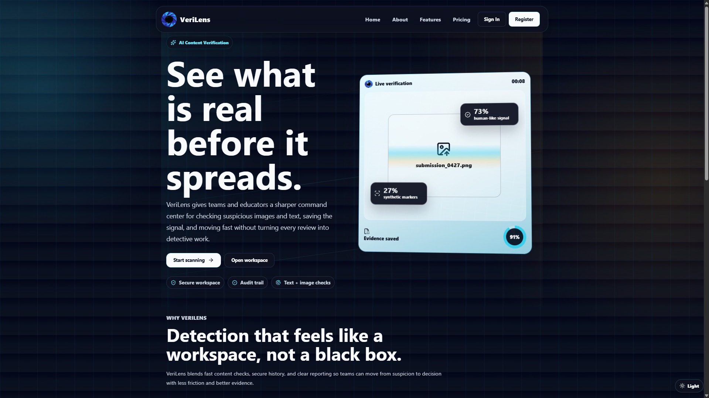
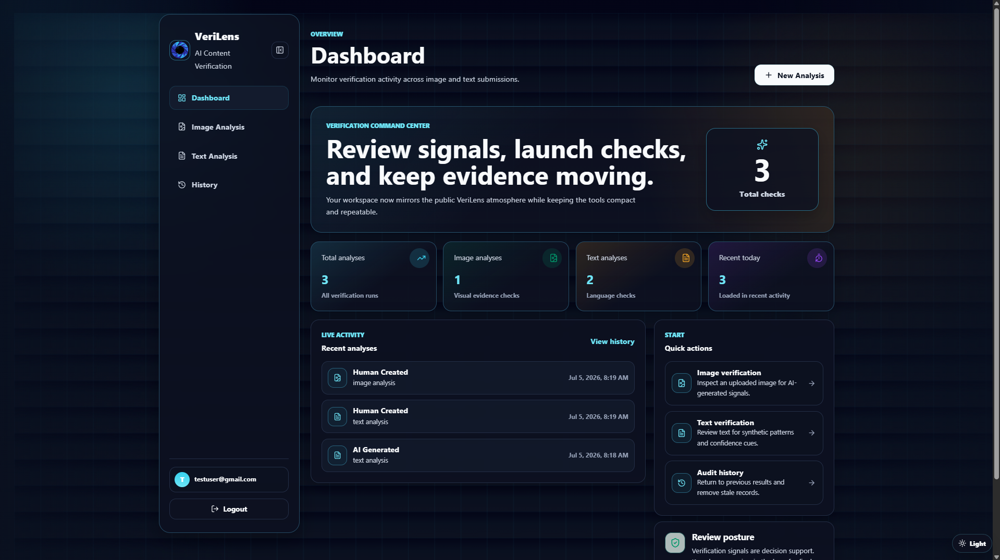
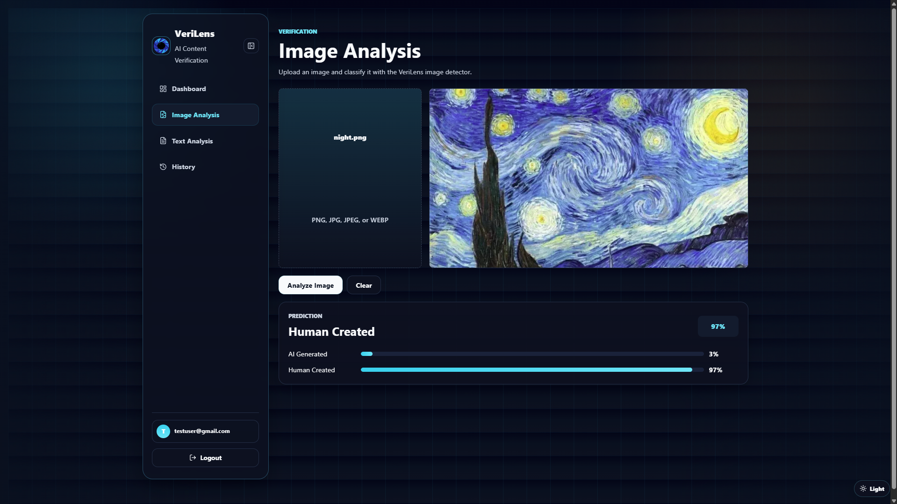
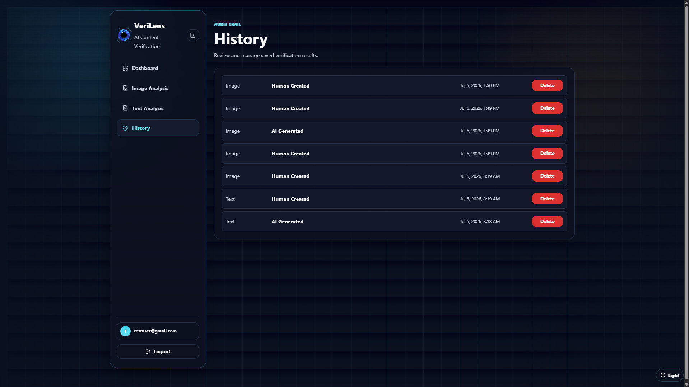
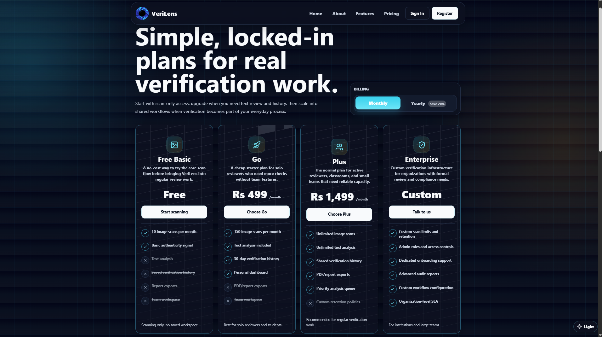

<p align="center">
  
</p>

<h1 align="center">VeriLens</h1>

<p align="center">
AI-powered content verification for images and text.
</p>

<p align="center">
Detect • Verify • Trust
</p>

---

VeriLens is a full-stack machine learning platform designed to help users identify whether digital content was created by humans or artificial intelligence.

The platform combines computer vision, stylometric text analysis, secure authentication, and persistent audit trails into a modern verification workspace built for students, researchers, educators, and organizations.

Built with React, FastAPI, MongoDB, and PyTorch.

---

## Application Preview

### 🏠 Landing Experience

<p align="center">
  
</p>

The landing experience introduces VeriLens as a unified verification platform capable of analyzing both text and image content while maintaining a clean, workspace-inspired interface.

---

### 📊 Dashboard

<p align="center">
  
</p>

The dashboard provides an overview of verification activity, recent analyses, quick actions, and user-specific statistics through a responsive command-center layout.

---

### 🖼️ Image Analysis

<p align="center">
  
</p>

Users can upload images and receive AI vs Human predictions with confidence scores and probability distributions generated using an EfficientNet-B0 model trained on a binary dataset.

---

### 📜 Verification History

<p align="center">
  
</p>

All verification records are stored per account, enabling users to review previous analyses, maintain audit trails, and manage their submission history.

---

### 💳 Pricing & Future Product Vision

<p align="center">
  
</p>

The platform architecture supports future subscription models, collaborative workflows, and scalable verification services for individuals and organizations.

---

## Technology Stack

| Layer | Technologies |
|---------|----------------|
| Frontend | React 19, Vite 6, TypeScript |
| Styling | Tailwind CSS 4, Radix UI, Lucide React |
| Backend | FastAPI, Motor, MongoDB |
| Authentication | JWT, bcrypt, python-jose |
| Machine Learning | PyTorch, Torchvision, EfficientNet-B0 |
| Image Processing | OpenCV, Pillow |

---

## Features

✓ Image authenticity detection using deep learning

✓ Text analysis using stylometric heuristics

✓ Confidence scores and probability breakdowns

✓ JWT-based authentication system

✓ User dashboards and recent activity tracking

✓ Persistent verification history

✓ Dark and light theme support

✓ Responsive workspace-inspired UI

✓ MongoDB-backed data persistence

---

## System Architecture

```text
Frontend (React + Vite)
            │
            ▼
Backend (FastAPI)
            │
     ┌──────┴──────┐
     ▼             ▼
 MongoDB      ML Inference
                │
                ▼
         EfficientNet-B0
```

---

## Running Locally

```bash
# Backend
cd Backend
python -m venv .venv
.venv\Scripts\activate
pip install -r requirements.txt
uvicorn app:app --reload

# Frontend
cd Frontend
npm install
npm run dev
```

---

VeriLens is currently under active development (`v0.1.0`) with ongoing work focused on explainability, model improvements, and production deployment.